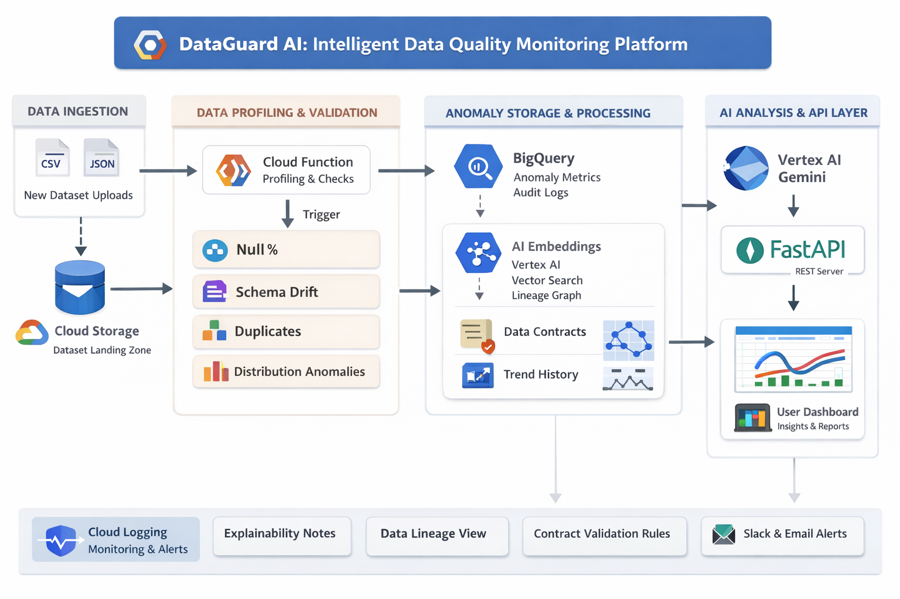

# DataGuard AI (Data Quality & Contract Monitoring Platform)
**🔗 Live Demo:** [https://dataguard-api-221367913882.europe-west2.run.app](https://dataguard-api-221367913882.europe-west2.run.app)


---

## Overview

This project is a cloud-native **data quality, schema governance, and contract monitoring platform** designed to provide a lightweight but production-minded way to validate datasets, track contract compliance, and surface data health through a web interface.

It is designed to act as a **central quality control layer** for analytical datasets, capable of:
- Registering and browsing datasets from cloud storage
- Running validation and contract checks against data assets
- Surfacing pass/fail outcomes through a web dashboard
- Monitoring schema and quality drift across datasets
- Providing a practical foundation for governed data platform workflows

This system showcases **production-grade data engineering architecture**, combining:
- **FastAPI-based backend services**
- **Cloud-native storage and runtime design**
- **Dataset and contract-driven validation workflows**
- **Operational monitoring pages for data quality results**
- **BigQuery-compatible warehouse patterns**
- **Deployment on Google Cloud Run**

---

## Features

### Smart Data Quality Dashboard
- FastAPI-powered web application
- Dataset discovery and browsing interface
- Contracts monitoring pages for validation outcomes
- Dataset-level navigation for quality workflows
- Operational visibility into data assets and validation status

---

### Data Contract & Validation Architecture
- **Dataset Registry Layer** → discovers and lists available datasets
- **Validation Layer** → executes checks against expected rules
- **Contract Monitoring Layer** → evaluates pass/fail outcomes for governed datasets
- **Presentation Layer** → exposes results through browser-accessible pages and endpoints

---

### Cloud-Native Monitoring Workflow
- Built for **serverless container execution**
- Supports dataset-driven validation flows instead of hardcoded one-off checks
- Designed for **separation of storage, validation, and presentation concerns**
- Deployable as an always-available monitoring service for internal data platform use

---

### Stateful Operational Context
- Tracks:
  - dataset identifiers
  - validation outcomes
  - contract status
  - page-level monitoring state
  - runtime environment configuration
- Supports repeated validation access patterns across datasets
- Preserves a clean separation between source data, metadata, and rendered results

---

### Structured Data Quality Visibility
- Dataset pages expose available monitored assets
- Contracts pages surface contract evaluation results
- Validation outputs can be extended for:
  - schema checks
  - null checks
  - freshness checks
  - uniqueness checks
  - rule-based compliance tests
- Provides a strong foundation for governed, observable analytics pipelines

---

### Cloud-Native Backend
- Deployable as a **Cloud Run web service**
- HTTP-based application architecture
- Suitable for connecting:
  - GCS-backed datasets
  - BigQuery-backed warehouse outputs
  - validation metadata
  - contract result artifacts
- Supports stateless runtime execution using external cloud storage and warehouse systems

---

## Architecture Overview



---

## System Design

### High-Level Flow

1. Data assets are stored in cloud-backed storage / analytics environments
2. The application discovers datasets available for monitoring
3. A user opens the web dashboard
4. The FastAPI backend loads dataset metadata and available validation context
5. Dataset pages expose monitored assets and navigation paths
6. Contract validation results are fetched for the selected dataset or monitoring scope
7. The backend renders quality and contract status through HTML pages / API responses
8. Users inspect health, failures, and governed dataset status
9. The platform acts as an operational quality checkpoint for downstream analytics workflows
10. The service remains deployable and scalable through Cloud Run

---

## Tech Stack

| Layer | Technology |
|------|-----------|
| Frontend | Server-rendered HTML / Jinja templates |
| Backend | Python, FastAPI |
| API Runtime | Uvicorn |
| Cloud Platform | Google Cloud Platform (GCP) |
| Runtime | Cloud Run |
| Storage | Google Cloud Storage |
| Data Warehouse | BigQuery |
| Dataset Metadata | JSON / cloud-hosted metadata patterns |
| Validation / Contracts | Custom Python validation logic |
| Configuration | Environment variables |
| Observability | Cloud Logging / Cloud Run logs |

---

## Platform Architecture

### Dataset Registry Layer
- Discovers and lists monitored datasets
- Provides routing into dataset-specific monitoring flows
- Supports future extension into richer metadata catalogs

### Validation Engine
- Evaluates datasets against defined data quality rules
- Can be extended for:
  - completeness checks
  - schema conformity
  - freshness checks
  - threshold rules
  - business-rule validations
- Produces structured outcomes for presentation and monitoring

### Contract Monitoring Layer
- Interprets validation results in a contract-style format
- Surfaces whether governed datasets meet expected conditions
- Enables page-level inspection of pass/fail quality status

### Presentation Layer
- Renders dataset and contract pages for operational users
- Supports navigation from summary views into specific quality contexts
- Provides a practical browser-based monitoring surface for data teams

---

## Validation State Schema

The platform conceptually maintains monitoring state that includes:
- `dataset_id`
- `dataset_name`
- `source_path`
- `validation_status`
- `contract_status`
- `validation_results`
- `schema_metadata`
- `last_run_time`
- `error_message`
- `environment`

This enables **dataset-aware, contract-aware, and operationally visible data quality monitoring**.

---

## Data Quality Pipeline

### Data Sources
- Cloud-hosted source datasets
- Curated analytics-ready datasets
- Validation metadata and contract definitions
- Warehouse tables and storage-backed data assets
- Platform configuration and monitoring artifacts

### Pipeline Steps
1. Dataset registration / discovery
2. Metadata loading
3. Validation rule evaluation
4. Contract result generation
5. Result persistence / retrieval
6. Dashboard rendering
7. Operational review of dataset health

---

## Dataset & Contract Runtime Loading

### Runtime Strategy
- Dataset inventory is loaded dynamically by the backend
- Validation and contract results are fetched at request time
- Storage and metadata remain external to the application container
- Cloud Run instances stay stateless while reading live operational context

### Why This Approach?
- Keeps the architecture **cloud-native and scalable**
- Avoids coupling runtime state to a single container instance
- Makes the service easy to redeploy without losing monitoring context
- Demonstrates production-minded separation between app logic and data state

---

## API & Page Design

### Core Application Surfaces
The platform exposes browser- and API-friendly routes for:
- home dashboard
- dataset listings
- contract monitoring views
- dataset-specific monitoring paths
- health and operational endpoints

### Why This Matters
- Makes the platform easy to inspect by engineers and stakeholders
- Supports both operational UI usage and programmatic extension
- Improves debugging when validation paths fail
- Creates a clean foundation for future monitoring automation

---

## Resilience & Reliability

### Built-In Reliability Mechanisms
- Stateless Cloud Run deployment
- Externalized storage and dataset state
- Environment variable-based runtime configuration
- Route separation for datasets, contracts, and monitoring views
- Compatibility with Cloud Logging for production debugging
- Easy extension for defensive error handling and graceful fallbacks

### Design Benefits
- Cleaner separation of concerns
- Easier deployment and rollback
- Better observability for failing validation paths
- Strong foundation for expanding into full data observability workflows

---

## Monitoring Workflow

1. User opens the dashboard
2. Backend serves the main monitoring interface
3. User navigates to the datasets page
4. Platform lists monitored datasets discovered from cloud-backed assets
5. User selects a dataset or contract view
6. Backend loads the relevant validation / contract result set
7. Results are rendered for review
8. Failures can be investigated using dataset-specific context and runtime logs

---

## Deployment Architecture

### Backend
- Python web service built with **FastAPI**
- Containerized and deployable to:
  - **Google Cloud Run**
  - other container-compatible runtimes if required

### Runtime Dependencies
- FastAPI
- Uvicorn
- Jinja2
- Google Cloud Storage client
- BigQuery client libraries
- Python validation utilities
- Cloud-native environment configuration

### Environment Variables
- `GCP_PROJECT`
- `GCS_BUCKET`
- `BIGQUERY_DATASET`
- `BIGQUERY_LOCATION`
- `PORT`
- `ENVIRONMENT`

---

## Local Development

### Prerequisites
- Python 3.11+
- pip / virtualenv
- Git
- GCP project access
- Google Cloud SDK
- GCS bucket and/or BigQuery access for monitored datasets

### Setup

```bash
git clone https://github.com/Stephen0111/dataguard-ai.git
cd dataguard-ai

python -m venv venv
source venv/bin/activate   # macOS/Linux
venv\Scripts\activate      # Windows

pip install -r requirements.txt
